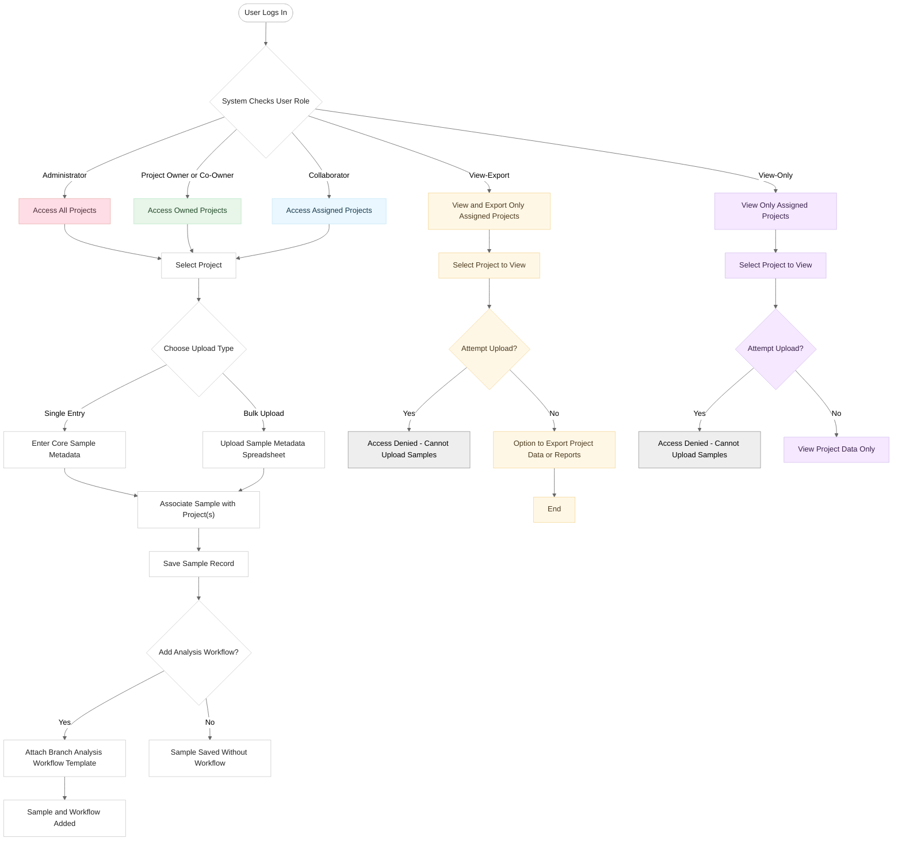

```mermaid
%%{init: {'theme': 'neutral'}}%%
flowchart TD

    %% -------------------------------
    %% Styling / class definitions
    %% -------------------------------
    classDef admin fill:#FFDDE6,stroke:#E6B0AA,stroke-width:1px,color:#4B2E39;
    classDef owner fill:#E8F5E9,stroke:#B9E9C7,stroke-width:1px,color:#214B28;
    classDef collaborator fill:#EAF7FF,stroke:#C6E7F8,stroke-width:1px,color:#173A4B;
    classDef viewexport fill:#FFF7E6,stroke:#F4D89A,stroke-width:1px,color:#4A3A1F;
    classDef viewonly fill:#F5E8FF,stroke:#D7C0F0,stroke-width:1px,color:#3A214A;
    classDef common fill:#FFFFFF,stroke:#CCCCCC,stroke-width:1px,color:#222222;


    A([User Logs In]) --> B{System Checks User Role}

    %% Branch by Role (compact entry nodes)
    B --> |Administrator| C1[Access All Projects]
    B --> |Project Owner or Co-Owner| C2[Access Owned Projects]
    B --> |Collaborator| C3[Access Assigned Projects]
    B --> |View-Export| C4[View and Export Only Assigned Projects]
    B --> |View-Only| C5[View Only Assigned Projects]

    %% Compact Routes for Admin / Owner / Collaborator
    C1 --> D_Select[Select Project]
    C2 --> D_Select
    C3 --> D_Select

    %% -------------------------------
    %% Shared "Core Upload Flow"
    %% -------------------------------
    D_Select --> E_Choose{Choose Upload Type}
    E_Choose --> |Single Entry| F_Enter[Enter Core Sample Metadata]
    E_Choose --> |Bulk Upload| G_Upload[Upload Sample Metadata Spreadsheet]
    F_Enter --> H_Assoc["Associate Sample with Project(s)"]
    G_Upload --> H_Assoc
    H_Assoc --> I_Save[Save Sample Record]
    I_Save --> J_Workflow{Add Analysis Workflow?}

    %% Role-specific workflow attachments
    J_Workflow --> |Yes| K_attach[Attach Branch Analysis Workflow Template]
    J_Workflow --> |No| L_no[Sample Saved Without Workflow]

    %% Final states (explicit separation)
    K_attach --> M_workflow[Sample and Workflow Added]

    %% View / Export 
    C4 --> D4[Select Project to View]
    D4 --> E4{Attempt Upload?}
    E4 --> |Yes| X4[Access Denied - Cannot Upload Samples]
    E4 --> |No| F4[Option to Export Project Data or Reports]
    F4 --> K4[End]

    %% View-Only branch
    C5 --> D5[Select Project to View]
    D5 --> E5{Attempt Upload?}
    E5 --> |Yes| X5[Access Denied - Cannot Upload Samples]
    E5 --> |No| K5[View Project Data Only]

    %% -------------------------------
    %% Assign classes to nodes
    %% -------------------------------
    class A,B common;
    %% Administrator / Owner / Collaborator entries
    class C1 admin;
    class C2 owner;
    class C3 collaborator;
    %% Shared core flow nodes
    class D_Select,E_Choose,F_Enter,G_Upload,H_Assoc,I_Save,J_Workflow,K_attach,L_no common;
    %% Final outputs
    class M_workflow,M_noWorkflow common;
    %% View & Export branch
    class C4,D4,E4,F4,K4 viewexport;
    %% View-Only branch
    class C5,D5,E5,K5 viewonly;
```
